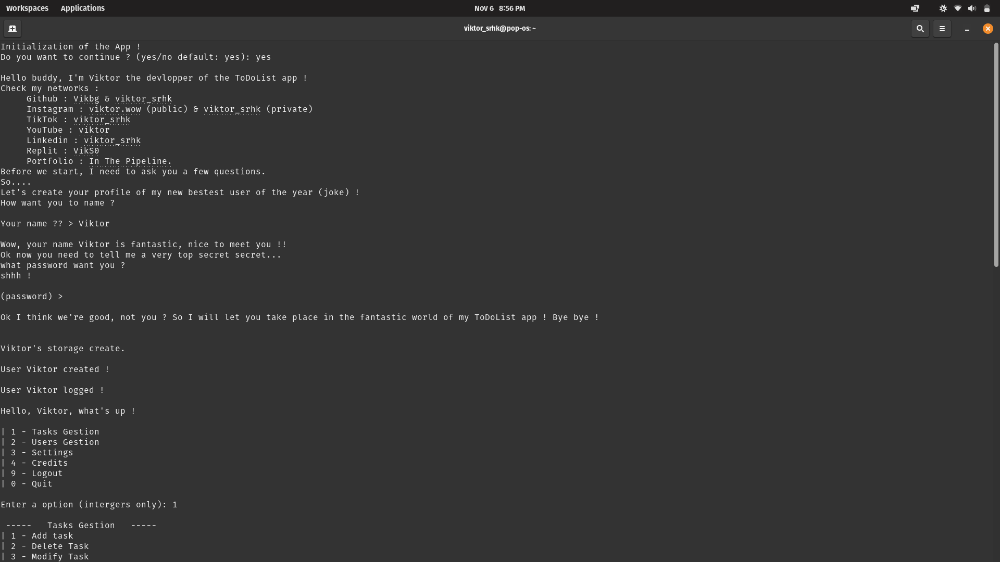
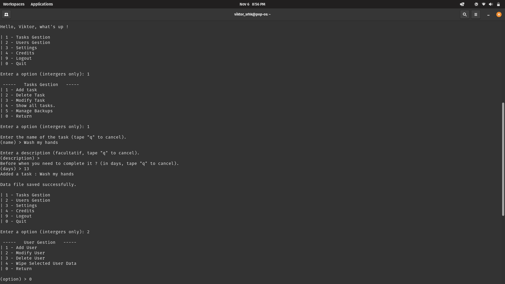
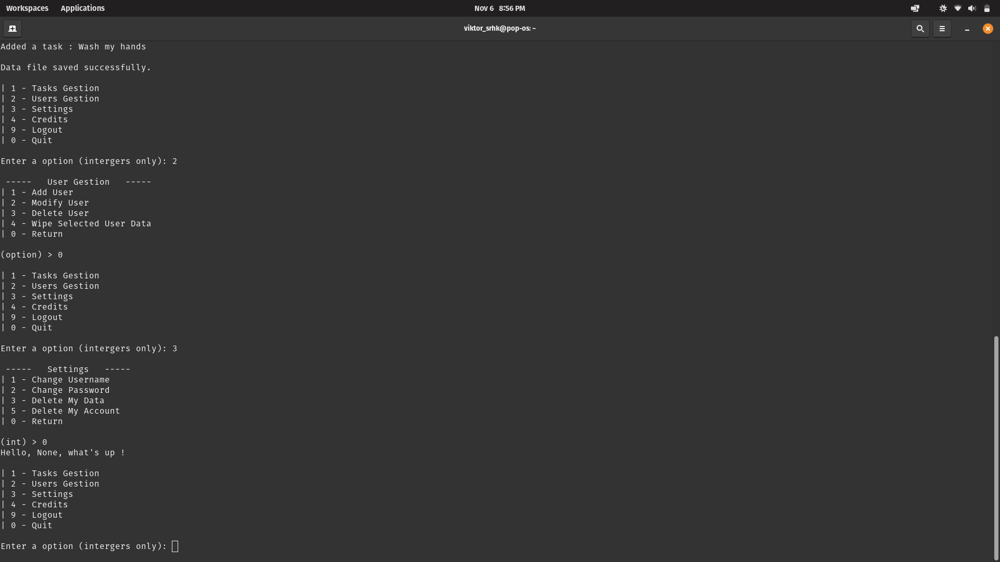

# 📝 ToDoList CLI App


A simple **command-line To-Do list manager** written in Python.


---

## 📸 Screenshots





---

## ⚙️ Features

- 👤 User management  
- ✅ Task creation, modification, and deletion  
- 💾 Automatic JSON backups  
- 🖥️ Intuitive CLI interface  

---

## 🚀 Installation

```bash
git clone https://github.com/Vikbg/todolist.git
cd todolist
python main.py
```

💡 Credits

Developed with ❤️ by Viktor Serhiienko (aka viktor_srhk)
📄 License

This project is licensed under the MIT License – see the LICENSE

file for details.

---
